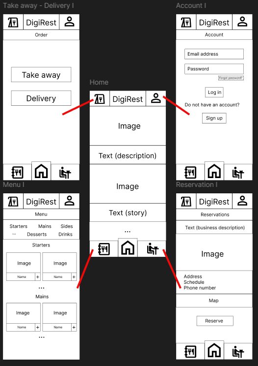
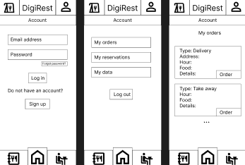

# DigiRest

The development of this application is part of the Bachelor's Thesis for the completion of the Bachelor's Degree in Computer Engineering at the Escuela Técnica Superior de Ingeniería Informática, Universidad Rey Juan Carlos.

**Author:** José Jesús Durán Quintana  
**Supervisor:** Michel Maes Bermejo

## Summary

This project involves the design and development of a web application for the digital management of restaurants. Unlike solutions designed for a specific establishment, this application is conceived as a generic and adaptable platform that can be implemented by any restaurant, regardless of its size or cuisine. The goal is to provide a flexible tool that improves operational efficiency, optimizes internal processes, and enhances the customer experience.

The web application will integrate essential functionalities such as a digital menu with product images and descriptions, online reservation management, and processing of online orders for delivery or pickup. Additionally, it will offer administrators advanced features for managing orders, reservations, and menu items, as well as access to statistics and analytical reports through interactive charts.

At this stage, only the objectives and functionalities of the web application have been defined. No implementation has been carried out yet.

## Objectives

### Functional Objectives
The application aims to provide a comprehensive platform for digital restaurant management, facilitating customer interaction, automating reservations and orders, and visualizing relevant data through charts and statistics. It focuses on improving operational efficiency and enhancing the user experience while ensuring secure and personalized information flow.

**Main functionalities:**
1.  Viewing the menu with images and product descriptions.
2.  Making simple and advanced reservations based on user type.
3.  Placing online orders with automatic total calculation.
4.  Managing order and reservation history for registered users.
5.  Managing reservations, orders, and products by the administrator.
6.  Viewing charts and statistics on occupancy, orders, and revenue.
7.  Email notifications for order and reservation confirmations.
8.  PDF generation of orders and invoices.
9.  Stock management and real-time product availability.

### Technical Objectives
The application will be developed using a modern, robust, and scalable technology stack. This approach ensures security, maintainability, and a clear separation of concerns between the frontend and backend, facilitating both development and future expansion.

**Main technical aspects:**

1. Implementation of a REST API using Java and the Spring Boot framework for server-side logic. This choice provides a mature, powerful, and enterprise-grade ecosystem for building web applications. Key benefits include dependency injection, built-in security features, a vast collection of libraries, and seamless integration with other technologies in the stack, which significantly accelerates development.

2. Development of a Single-Page Application (SPA) for the client-side user interface using the Angular framework. This provides users with a dynamic, fluid, and responsive experience similar to a desktop application, without constant page reloads.

3. Use of a relational MySQL database for persistent data storage. Its proven reliability, robustness, and clear structure make it ideal for managing the structured data of the application's entities (Users, Products, Orders, Reservations).

4. Management of the source code for both the frontend and backend using Git and hosting on GitHub. This platform facilitates version control, collaborative development, code review, and issue tracking throughout the project's lifecycle.

5. Automation of the software delivery process through a Continuous Integration and Continuous Deployment (CI/CD) pipeline implemented with GitHub Actions. This allows for the automatic execution of tasks such as running test suites, building the application, and deploying it to a testing or production environment upon every code push, ensuring code quality and streamlining updates.

6. Execution of a comprehensive testing strategy using JUnit and Rest Assured to validate the core business logic and API endpoints, and Selenium for end-to-end (E2E) tests that automate browser actions and simulate user interactions.

7. Integration of interactive charts for statistics and reports.

8. Integration of interactive maps (Google Maps).

9. Implementation of algorithms for total calculation, stock management, and estimated time calculations.

## Methodology

*   **Phase 1 - Definition of functionalities and screens (September 1 - September 15):** Define the functionality of the web application, including interaction design (screens, transitions, etc.). Differentiate functionality based on user roles (anonymous user, registered user, and administrator). Divide functionalities into:
    *   **Basic functionality:** Core features for anonymous, registered, and administrator users.
    *   **Intermediate functionality:** Additional features beyond the core.
    *   **Advanced functionality:** Final features for the completed application.

*   **Phase 2 - Repository, testing, and CI (September 16 - October 15):** Create the Git repository and client/server projects. Implement the minimum functionality to connect client, server, and database. Implement basic automated tests and configure the continuous integration system.

*   **Phase 3 - Version 0.1 - Basic functionality and Docker (October 16 - December 15):** Expand functionality to cover all basic features (with corresponding automated tests) and package the application using Docker. Add continuous delivery capabilities. Publish version 0.1 of the application.

*   **Phase 4 - Version 0.2 - Intermediate functionality (December 16 - March 1):** Expand functionality to include all intermediate features (with corresponding automated tests) and deploy the application. Publish version 0.2 of the application.

*   **Phase 5 - Version 1.0 - Advanced functionality (March 2 - April 15):** Complete the application with all advanced features and publish version 1.0.

*   **Phase 6 - Report (April 16 - May 15):** Prepare the first draft of the project report.

*   **Phase 7 - Defense (May 16 - July 31):** Conduct the final defense of the project.

## Web Application Functionalities

### Basic Functionality

**Non-registered Users:**
*   Browse website sections: home, menu, contact.
*   View the menu with images and product descriptions.
*   Check reservation availability and make basic reservations without registering.
*   View general occupancy charts by hour.

**Registered Users:**
*   Access all functionalities of non-registered users.
*   Make detailed reservations indicating the number of diners, allergies, and preferences.
*   Place online orders (for delivery or pickup) with automatic total calculation.
*   View order and reservation history.
*   Update profile information and profile picture.

**Administrator:**
*   Manage reservations and orders (accept, modify, or cancel).
*   Add, edit, and remove menu items with images and descriptions.
*   View basic sales and reservation reports using interactive charts.

### Intermediate Functionality
*   Filter products by category (starters, main courses, desserts, beverages).
*   Email notifications for order and reservation confirmations.
*   Generate PDFs with order summaries or invoices.
*   Real-time stock management, marking products as available or unavailable.
*   Advanced charts for administrators: orders by day/week, best-selling products, total revenue.
*   Interactive maps showing restaurant location and possible branches.

### Advanced Functionality
*   Automatic calculation of estimated preparation or delivery time for orders.
*   Advanced reservation management with filters by date, number of diners, and restrictions (allergies, preferences).
*   Integration with external APIs to enhance user experience (e.g., weather info, menu suggestions).
*   WebSockets for real-time updates (order status, table availability).

## Screens

**Home:**
the home page serves as the main landing page, featuring links to all sections and providing general information about the restaurant. This includes details such as the restaurant's history and the type of cuisine it offers, accompanied by promotional images.

**Menu:**
this section displays the restaurant's complete menu, organized into categorized sections. Users can view details for each dish, including images, descriptions, and allergen information.

**Reservation:**
the reservation section provides the restaurant's contact information and includes a form for customers to make table reservations.

**Order:**
this section enables users to place orders for either delivery or pickup. It includes screens for entering order details, selecting food items, and completing the payment process.

**Account:**
the account section allows registered users to manage their account details. It includes screens for user registration (for new customers), login, and once authenticated, managing previous orders and reservations.

## Main Entities

1.  **User**: id, name, email, password, type (customer or administrator), profile picture, order and reservation history.
2.  **Product**: id, name, description, category, price, image, availability.
3.  **Order**: id, user, list of products, quantity, total, status, date/time, type (delivery or pickup).
4.  **Reservation**: id, user, date/time, number of diners, status, notes (allergies, preferences).

**Main relationships:**
*   A **user** can have many **orders** and many **reservations**.
*   An **order** can include multiple **products** (many-to-many relationship).

## User Types and Permissions

*   **Anonymous User:** can only view the menu, check reservation availability, and make basic reservations.
*   **Registered User:** can place online orders, manage advanced reservations, and access their profile and history.
*   **Administrator:** has full control over the website, including management of reservations, orders, products, reports, and statistics.
*   **Security permissions:** users can only edit or delete their own orders and reservations; the administrator can modify any data.

## Images

*   Each **product** will have an associated image displayed in the menu.
*   Each **registered user** can upload an optional profile picture.
*   General restaurant images will be included on the home page and for promotions.
*   Image upload from the browser will support common formats (JPG, PNG).

## Charts

*   **Users (registered and non-registered):** bar charts showing restaurant occupancy by hour and day.
*   **Administrators:** more detailed charts on orders (orders per day/week, best-selling products, total revenue).
*   Visualization libraries will allow for interactive filtering by date or category.

## Complementary Technologies

*   Automatic email notifications for reservation and order confirmations.
*   PDF generation for downloadable order summaries or invoices.
*   Interactive maps with Google Maps to show the restaurant location and possible branches.
*   Optional WebSockets for real-time updates on order status or table availability.
*   Integration with external APIs to enhance the user experience (e.g., weather information, recommendations).

## Advanced Queries and Algorithms

*   **Dynamic calculation of order total**, considering quantity and product availability.
*   **Real-time stock management**, marking products as available or unavailable based on inventory.
*   **Estimated preparation and delivery time** for orders.
*   **Advanced reservation management** with filters such as number of diners, date, time, and allergies.
*   **Generation of custom statistics and reports** for administrators using complex database queries.